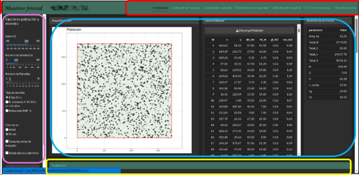

**2.1 Aplicación Muestreo forestal**

Esta aplicación ha sido desarrollada para la asignatura Selvicultura e Inventariación forestal del Grado de Ingenieria Forestal: Industrias forestales, impartida en la EiFAB de Soria, Universidad de Valladolid. La aplicación trata el bloque de muestreo, salvo el muestreo estratificado.

La aplicación se organiza en siete pestañas o pantallas, cada una dedicada a un aspecto específico del bloque de muestreo y deben verse de manera secuencial. En cada pestaña se incluye una sección con explicaciones teóricas.

La interfaz se divide en cuatro áreas principales (Figura 1).

-   En la parte superior (recuadro rojo) se encuentra el selector de temas, diseñado para su utilización secuencial.

-   El panel izquierdo (malva) contiene los principales controles de la aplicación.

-   En la zona central (azul) se muestran las salidas gráficas y tabulares correspondientes a cada tema.

-   Finalmente, en la parte inferior (amarillo) aparecen las explicaciones teóricas asociadas.

**El tamaño de visualización puede ajustarse utilizando la combinación de la tecla Ctrl y la rueda del ratón**, lo que permite ampliar o reducir la escala de los elementos. Nota: actualmente la aplicación está en un servicio gratuito de hosting que no es muy rápido, las poblaciones tardan un entre uno y cinco segundos en regenerarse, no hay que impacientarse.

Figura 1. Secciones de la aplicación Muestreo forestal.

Pestañas disponibles:

1.  [Población](help/1_Poblacion.Rmd)

2.  [Selección de muestra](help/2_Seleccion.Rmd)

3.  [Estimación con una parcela](help/1_OnePlot.Rmd)

4.  [Estimación con n parcelas (estimación puntual)](help/4_nPlots.Rmd)

5.  [Estimación con n parcelas (distribución muestral)](help/5_Samp_dist.Rmd)

6.  [Estimación con n parcelas (Intervalos de confianza y error de muestreo)](help/6_Interval_error.Rmd)

7.  [Estimación con n parcelas (dimensionamiento de muestra)](help/7_Samp_aloc.Rmd)
