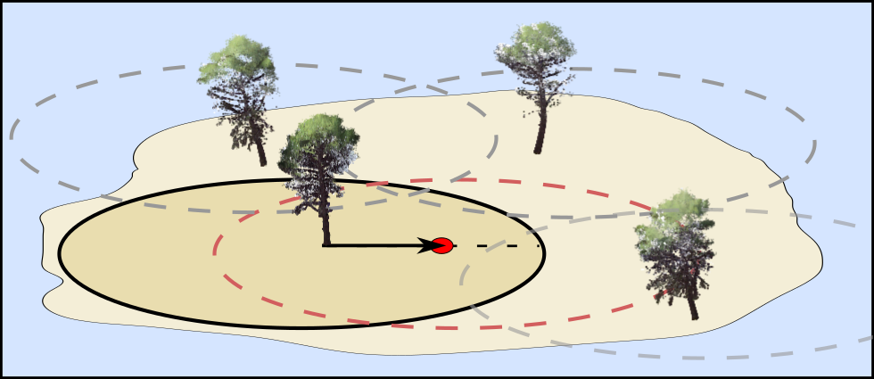
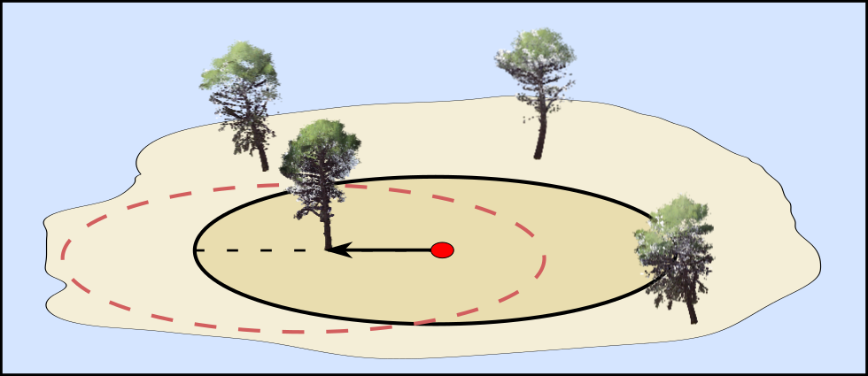
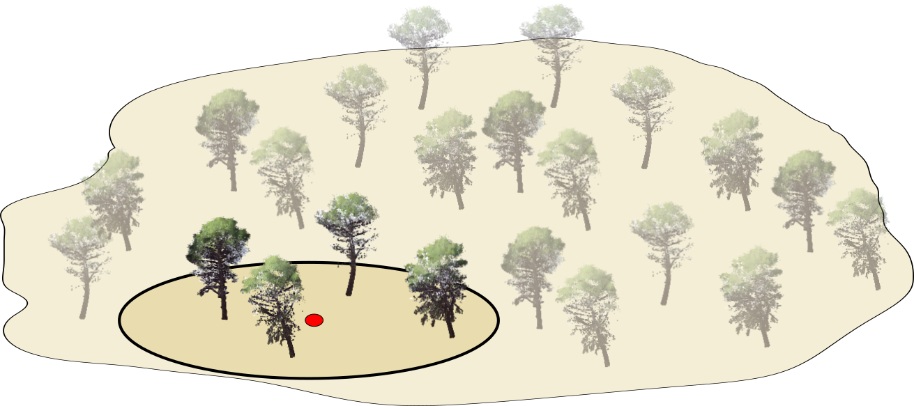

#### Introducción

Vamos a considerar el experimento aleatorio de ubicar una parcela uniformemente al azar en la zona a maestrear. A partir de la ubicación de este punto se determinarán los árboles que formarán parte de la muestra. Como la ubicación del punto de muestreo es aleatoria, los árboles que formarán la muestra también lo serán. Podemos analizar el proceso de selección de muestras desde dos puntos de vista complementarios que nos permitirán deducir, de una forma sencilla y visual, probabilidades de inclusión en la muestra ($\pi_i$) y factores de expansión ($w_i$) que nos serán útiles en el proceso de estimación.

Antes de continuar vamos a ver con algo más de detalle ambas formas de visualizar el problema empleando parcelas de radio fijo. Un árbol se medirá cuando la distancia entre el árbol y el punto aleatorizado (centro de parcela) sea menor que una distancia determinada en función del tipo de parcela (radio o radios de parcela).

Al medir distancias es indiferente que punto consideramos como origen, la distancia del centro al árbol es la misma que del árbol al centro de parcela. Sin embargo, desde un punto de vista meramente visual, comprobar distancias posicionándonos en el árbol proporciona una visión alternativa a posicionarnos en el centro de parcela y ambas son interesantes.

#### Selección basada en áreas de inclusión centradas en los árboles

La primera forma de ver cuando muestrearíamos un árbol sería centrarse en el árbol. Comenzaremos trazando un círculo (del radio que corresponda en función del diámetro del árbol y tipo de parcela) en torno a cada árbol. Llamaremos a estos círculos áreas de inclusión del árbol. La distancia entre el punto de medición y un árbol determinado será menor que el radio de parcela correspondiente, si el punto de medición cae dentro del área de inclusión o circulo trazado en torno al árbol. Es decir, los árboles a medir serán aquellos para los que el punto de medición ha caído dentro de su área de inclusión.

{width="100%"}

#### Probabilidades de inclusión en la muestra

En esta representación es muy sencillo inferir las probabilidades de inclusión de árboles (salvo para árboles en el borde). La probabilidad de que un determinado árbol este incluido en la muestra es la probabilidad de caer en su área de inclusión. Como los puntos de muestreo se determinan uniformemente al azar, tenemos que para el árbol $i$ esta probabilidad de inclusión $\pi_i$ será el ratio entre el área del área de selección, $a_{inclusion,i}$ y el área a muestrear $A$, con ambas áreas en las mismas unidades. Es decir:

$$
\pi_i = \frac{a_{inclusion,i}}{A}
$$

#### Selección basada en áreas de inclusión centradas en los árboles

La forma de seleccionar la muestra más parecida a lo que realizamos en campo es centrarnos en el punto de medición y hacer un circulo (o círculos para parcelas con radio variable y de relascopio) en torno al punto de medición o centro de parcela. Los árboles que formarán la muestra serán aquellos que estén dentro del círculo (o círculos) realizados en torno al centro de parcela.

{width="100%"}

#### Factores de expansión

Mientras que el punto de vista centrado en los árboles es muy gráfico a la hora de determinar probabilidades de incluir un determinado árbol en la muestra, el enfoque centrado en el punto de muestreo nos permite realizar interpretaciones muy gráficas de lo que llamamos factores de expansión. Para ver los factores de expansión emplearemos un ejemplo donde suponemos que hemos muestreado una zona de dos hectáreas con radio de parcela que resulta en una superficie de $1/3$ hectáreas. En nuestra parcela han entrado cuatro árboles.

{width="100%"}

Si sabemos que nuestra parcela es de $\frac{1}{3}$ hectáreas. En base a nuestras mediciones esperaríamos tener $3x4=12$ árboles en cada hectárea y 24 en la zona a muestrear. En realidad hay 23 árboles en la zona a muestrear y $N=12.5$, sin embargo, podemos ver que el inverso del área de la parcela $\frac{1}{a_{inclusion}(ha)}$ nos permite aproximarnos al valor total de árboles por unidad hectárea y al número de árboles total. **Básicamente extrapolamos lo que hemos medido en la parcela a una hectárea y de ahí al total de la superficie muestreada.**

Al inverso del área de la parcela se le llama factor de expansión $w_i=\frac{1}{a_{inclusion,i}(ha)}$ y tiene una interpretación muy intuitiva. Si el área de inclusión de un árbol es $\frac{1}{k}$ ha, entonces, en una hectárea esperaremos encontrar $k$ árboles similares al árbol muestreado. Importante, en estos ejemplos hemos usado parcelas de radio fijo, y todas las áreas de inclusión son iguales, cuando tenemos parcelas de radios anidados o de relascopio, el área de inclusión depende del diámetro del árbol por eso incluimos en el el factor de expansión el subíndice $i$ que identifica al árbol.

**Ejemplo 1:**

Si tenemos parcelas de radio fijo donde el área de inclusión de todos los árboles de 0.1 hectáreas, por cada árbol que muestreemos, esperaríamos tener 10 árboles en cada hectárea.

**Ejemplo 2:**

Si tenemos parcelas de radio variable donde los árboles menores de 7.5 cm se muestrean con un área de 0.05ha y los árboles mayores con un radio que resulta en un área de 0.1ha. entonces:

-   Por cada árbol menor que muestreemos esperaremos encontrar 20 árboles similares en cada ha.

-   Por cada árbol mayor, esperaremos encontrar 10 árboles similares por hectárea.

Además de esta interpretación, el factor de expansión está directamente relacionado con la probabilidad de inclusión.

**Normalmente, las áreas muestreadas se miden en hectáreas de modo que es más cómodo si expresamos siempre áreas parcela y áreas a muestrear en estas unidades. Esto no es obligatorio, pero sí que es necesario saber en qué unidades se trabaja y ser consistente, especialmente cuando se calculan probabilidades de inclusión donde es necesario usar las mismas unidades en numerador y denominador**.

#### Áreas de inclusión y factores de expansión

Dado que normalmente el área a muestrear $A$ es conocida, operando podemos relacionar factores de expansión y probabilidades de inclusión. Ambas cantidades de la siguiente manera:

$$
w_i = \frac{1}{a_{inclusión,i}}(ha)\: and \: \: \pi_i=\frac{a_{inclusion,i}(ha)}{A(ha)}\rightarrow\pi_i=\frac{1}{A(ha)w_i}
$$

También podemos usar esta ecuación para establecer el factor de expansión como

$$w_i=\frac{1}{A(ha)*\pi_i}$$

#### Controles de la pestaña

En esta pestaña puedes experimentar con distintos diseños de parcela. En la parte superior tienes el proceso de selección de árboles basado en áreas de inclusión. En la parte inferior tienes el proceso de selección centrado en el punto de medición.

Si activas el control **Todas las áreas de inclusión** podrás ver el área de inclusión de cada árbol para los distintos tipos de parcela. Al pulsar el botón **muestrear**, verás cómo se destacan los árboles seleccionados (es decir aquellos para los que el punto de parcela ha caído dentro del área de inclusión).

Se consideran los siguientes tipos de parcela:

**Radio fijo**

Para parcelas de radio fijo, la probabilidad de inclusión en la muestra $\pi_i$ para el árbol $i$ es:

$$
\pi_i = \frac{\pi r_p^2(ha)}{A(ha)}
$$

donde $r_p$ es el radio de la parcela y $A$ el área muestreada en las mismas unidades. El factor de expansión en este caso es igual para todos los árboles y es igual al inverso del área de la parcela en hectáreas $w_i=\frac{1}{\pi r^2(ha)}$

**Radios anidados**

Para parcelas de radio fijo, la probabilidad de inclusión en la muestra $\pi_i$ para el árbol $i$ es:

$$
\pi_i = \begin{cases}
\frac{\pi r_1^2(ha)}{A(ha)}, & \text{si } dn<15cm\\
\frac{\pi r_2^2(ha)}{A(ha)}, & \text{si } dn \ge 15cm
\end{cases}
$$

donde $r_1=10$ y $r_2=20$ son los radios asociados a las clases de tamaño 1 (menores de 15 cm de diámetro normal) y 2 (diámetro normal mayor o igual a 15 cm) del ejemplo. $A$ es el área muestreada. **Importante,** hemos considerado los radios de parcela y clases del ejemplo. Si hubiese más de dos clases, el procedimiento sería el mismo, pero tendríamos más casos. Por otro lado, con parcelas de radios anidados y de relascopio, visualmente, puede ser difícil establecer que radio se corresponde con qué árbol.

En base a las probabilidades de inclusión podemos establecer los factores de expansión:

$$
w_i = \begin{cases}
\frac{1}{\pi r_1^2(ha)}, & \text{si } dn<15cm\\
\frac{1}{\pi r_2^2(ha)}, & \text{si } dn \ge 15cm
\end{cases}
$$

**Relascopio**

El último tipo de parcela considerado es el de parcelas de relascopio con un BAF de 1. Cuando el BAF es 1, el área de inclusión de un árbol tiene un radio\\diámetro igual al radio\\diámetro del árbol pero expresado en metros. En este caso, el área de inclusión en hectáreas es igual a $\pi_i = \frac{\pi dn_i^2}{4*1000}$. En base a esto se puede calcular la probabilidad de inclusión del árbol $i$ como:

$$\pi_i = \frac{\pi dn_i^2}{4*10000}*\frac{1}{A}$$ El factor de expansión en este caso es igual a

$$
w_i=\frac{1}{\frac{\pi dn_i^2}{4*10000}}
$$

En las parcelas de radios anidados solo hemos considerado dos clases de tamaño, pero esto no tiene porqué ser así siempre, podrían considerarse tantas clases como quisiésemos. En este sentido, el relascopio es una generalización de las parcelas de radios anidados donde hay infinitos posibles tamaños de parcela, uno por cada posible diámetro normal. También podemos ver esto de otra forma, cada árbol tiene un radio o diámetro de parcela propio y proporcional al diámetro normal.

#### Efectos de borde

En las explicaciones y formulas anteriores no hemos considerado qué pasa con los árboles cuya área de inclusión corta con los límites de área muestrear. Para estos árboles el área que tendríamos que considerar al determinar probabilidades de inclusión sería sólo la que está dentro de la zona que muestreamos. En el resto de la asignatura simplemente consideraremos que estos efectos son despreciables. Aunque no vamos a hacer un tratamiento formal de estos efectos de borde, si que puedes comprobar gráficamente que estos tienden a hacerse muy pequeños si aumentas el lado del área a muestrear.
