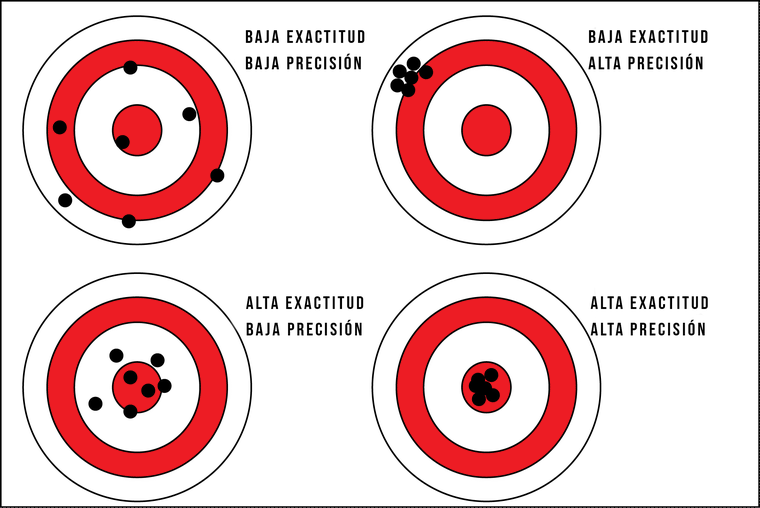
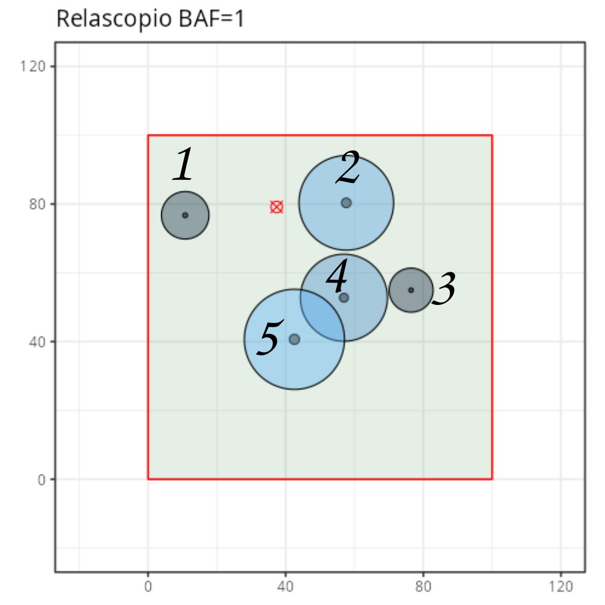
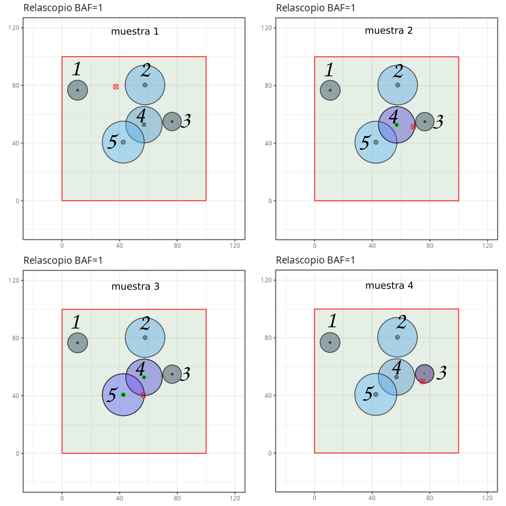

#### Introducción

En esta pestaña se explica cómo se hace la estimación de un parámetro de interés (ver pestaña **Población**) cuando se considera el experimento aleatorio de:

1.  Seleccionar una ubicación al azar en la zona a muestrear

2.  Seleccionar los árboles que compondrán la muestra en base al tipo de parcela empleado

3.  Calcular estimaciones de parcela a partir del conjunto de árboles seleccionados

La base de la estimación será el estimador de Horvitz-Thompson para totales o su versión para totales por unidad de área. Ambas versiones pueden intercambiarse casi de forma directa ya que el área a muestrear $A$ normalmente es conocida.

Antes de continuar, se recomienda pulsar el botón **Regenera población** para no acumular muestras de las pruebas realizadas en pestañas anteriores.

#### Parámetros de interés

Vamos a hacer un pequeño recordatorio de los tipos de parámetros de interés que vimos en la pestaña 1 **Población**. Es importante tener en cuenta que estos valores nunca los conoceremos en casos reales y que nuestro objetivo es estimarlos.

***Totales***

De forma genérica, un total se define como la suma de una variable de interés $y_i$ para todo los árboles $i$ de la zona a muestrear. Un total por unidad de área simplemente consiste en dividir el total por el área muestreada. Si usamos el símbolo $\mathcal{N}$ (**N de bordes redondeados**) para representar el número de árboles en la zona a muestrear (**parámetro desconocido**) tenemos que totales y totales por unidad de área se expresan como:

$$Total(y)=\sum_{i=1}^{\mathcal{N}}y_i \qquad \qquad \text{Total por unidad de área}(y)=\frac{1}{A}\sum_{i=1}^{\mathcal{N}}y_i$$

Dos ejemplos de totales por unidad de área son la densidad $N$ y el área basimétrica $G$. Para la densidad, $N$ (**N con bordes rectos**), $y_i$ es igual a 1 para todos los árboles, para $G$, $y_i$ es la sección normal (en metros cuadrados) de cada árbol.

***Funciones de totales***

Si bien los totales son, seguramente, los parámetros de interés más importantes desde el punto de los inventarios. Muchas variables dasométricas que querremos estimar no son totales si no funciones que implican más de un total. En este sentido destacan los valores medios.

$$Media(y)=\frac{\sum_{i=1}^{\mathcal{N}}y_i}{\mathcal{N}}=\frac{\sum_{i=1}^{\mathcal{N}}y_i}{\sum_{i=1}^{\mathcal{N}}1}$$

Pero $\mathcal{N}$ es en sí un total donde $y_i$ es uno para todos los árboles, de forma que **los valores medios son ratios de totales**.

Otro ejemplo de parámetro de interés que se expresa como función de totales es el diámetro cuadrático medio $d_g$. Partiendo de la propia definición de $d_g$ o diámetro del árbol de sección normal media. Vemos que $d_g$ es una función de dos totales $G$ y $N$

$$\frac{\pi d_g^2(m)}{4}=\frac{AG}{AN} \rightarrow d_g(m) = \sqrt{\frac{4G}{\pi N}}\rightarrow d_g(cm)=100*d_g(m)$$

***Otros parámetros complejos***

Hay variables dasométricas que no son totales o funciones o ratios de totales. En este apartado destacan las alturas y diámetros dominantes, que suelen definirse como alturas o diámetros medios del conjunto de árboles dominantes. $\mathcal{D}$.

$$h_o= \frac{1}{\mathcal{N_{D}}}\sum\limits_{i\in D}h_i$$

$$d_o= \frac{1}{\mathcal{N_{D}}}\sum\limits_{i\in D}d_i$$

Bajo el criterio de Assmann, el conjunto de árboles dominantes es el conjunto de los 100 individuos con mayor diámetro de la hectárea.

#### Estimador de Horvitz-Thompson de parcela para totales o totales por unidad de área.

En esta sección se explica cómo se obtienen estimaciones de parcela (panel central y medio) a partir de las mediciones de árboles (panel izquierdo).

Cuando nuestro objetivo es estimar un total o un total por unidad de área emplearemos el estimador de parcela de Horvitz-Thompson aunque a partir de ahora simplemente nos referiremos a este estimador como estimador de parcela para totales o totales por unidad de área.

Para indicar estimaciones, añadiremos el acento circunflejo \^ sobre el parámetro de interés. A continuación se indica cómo se calcula el estimador de parcela para un total y para un total por unidad:

$$\hat{Total(y)}=\begin{cases}
\sum\limits_{i\in muestra}\frac{y_i}{\pi_i} , & \text{si se ha seleccionado algún árbol} \\
 & \\
0, & \text{si la no se ha seleccionado ningún árbol}
\end{cases}$$

$$\hat{Total~por~unidad~area(y)}=\begin{cases}
\frac{1}{A}\sum\limits_{i\in muestra}\frac{y_i}{\pi_i} = \sum\limits_{i\in muestra}\frac{y_i}{A\frac{a_{parcela,i}}{A}} = \sum\limits_{i\in muestra}y_iw_i , & \text{si se ha seleccionado algún árbol} \\
 & \\
0, & \text{si la no se ha seleccionado ningún árbol}
\end{cases}$$

Es importante mencionar dos cuestiones. Primero, ambos estimadores son igual a cero si la muestra está vacía (es decir si no se ha seleccionado ningún árbol). Por otro lado, para totales por unidad de área, el área a muestrear $A$, aparece dividiendo al total, pero también aparece de forma implícita en las $\pi_i$ . Estas áreas se cancelan y el estimador tiene una forma sumamente sencilla donde lo único que hay que hacer es multiplicar la variable de interés $y_i$ por el factor de expansión $w_i$ y sumar para todos los árboles de la parcela. O si se prefiere, hay que dividir el valor de la variable de interés $y_i$ de cada árbol seleccionado a su área de inclusión o área de parcela correspondiente $a_{parcela,i}$ y sumar.

$$\hat{Total ~ por ~ unidad~area(y)}=\begin{cases}\sum\limits_{i\in muestra}\frac{y_i}{a_{parcela,i}}= 
\sum\limits_{i\in muestra}y_iw_i  , & \text{si se ha seleccionado algún árbol} \\
 & \\
0, & \text{si la no se ha seleccionado ningún árbol}
\end{cases}$$

Si no te gusta memorizar puedes deducir estas fórmulas recordando: (1) la interpretación de factor de expansión como número de árboles similares al árbol muestreado que esperamos encontrar en una hectárea de terreno y (2) que un total por unidad de área es la suma de la variable de interés para todos los árboles de la hectárea. Como cada árbol muestreado representa $w_i$ árboles en la hectárea de terreno por lo que lo único que hay que hacer es sumar la variable de interés de cada árbol muestreado $y_i$ multiplicada por $w_i$ (el número de árboles que representa el árbol $i$ en la hectárea).

En el panel izquierdo de esta pestaña tienes las mediciones a nivel de árbol que se haría en la parcela. Recuerda que para obtener un determinado total por unidad de área solo tenemos que multiplicar la columna de la variable para la que queremos hacer el total por unidad de área por el factor de expansión correspondiente y sumar. Si queremos estimar $N$ esta columna siempre valdría 1 por lo que el $y_i*w_i=1*w_i=w_i$ y basta con sumar los factores de expansión. Puedes descargar datos de parcelas simuladas y practicar en Excel, para ello, comienza calculando las áreas de inclusión o las $w_i$ de cada árbol en función de su diámetro normal.

***Ejemplo 1:***

$$\hat{G}=\begin{cases}
\sum\limits_{i\in muestra}g_iw_i  , & \text{si se ha seleccionado algún árbol} \\
 & \\
0, & \text{si no se ha seleccionado ningún árbol}
\end{cases}$$

**IMPORTANTE:** Lee la sección **Uso e historia del relascopio** al final de esta página.

***Ejemplo 2:***

$$\hat{N}=\begin{cases}
\sum\limits_{i\in muestra}1w_i  , & \text{si se ha seleccionado algún árbol} \\
 & \\
0, & \text{si la no se ha seleccionado ningún árbol}
\end{cases}$$

#### Estimador de parcela para ratios y funciones de totales

Cuando consideremos la estimación de parámetros medios (ratios de totales) o funciones de totales, simplemente haremos el estimador de parcela para cada uno de los totales.

***Ejemplo 3:***

Si el parámetro de interés es la altura media:

$$\bar{h}=\frac{\sum_{i=1}^{\mathcal{N}}y_i}{\mathcal{N}}=\frac{\frac{1}{A}\sum_{i=1}^{\mathcal{N}}y_i}{\frac{1}{A}\sum_{i=1}^{\mathcal{N}}1}$$

La altura media es el ratio de dos totales por unidad de área, el total de las alturas $y_i\rightarrow h_i$ y $N$ (el total de una variable que vale 1 para todos los árboles). En este caso, simplemente haremos el estimador de parcela para el numerador y el estimador por parcela para el denominador y después haremos el ratio.

$$\hat{\bar{h}}=\frac{\sum\limits_{i\in muestra}h_iw_i}{\sum\limits_{i\in muestra}1w_i}$$

***Ejemplo 4:***

Para estimar $d_g$ estimaremos $G$ y $N$ tal como se hace en los ejemplos 1 y 2, y después sustituiremos en la ecuación de $d_g$ para obtener el estimador de parcela.

$$\hat{d_g}(cm) = 100 \sqrt{\frac{4\hat{G}}{\pi \hat{N}}}$$

#### Estimador de parcela para parámetros complejos (alturas y diámetros dominantes)

Para alturas y diámetros dominantes, la estimación se hará construyendo análogos de parcela. En este caso, lo primero que haremos será ordenar la tabla de mediciones por diámetro en orden decreciente. Después, iremos sumando los factores de expansión hasta alcanzar 100 árboles por hectárea. Esto nos permitirá estimar el conjunto de árboles dominantes de la parcela. Una vez tengamos este conjunto $\hat{dominantes}$ simplemente calcularemos los valores medios como hemos hecho en el ejemplo 3, pero trabajando sobre el conjunto de los árboles dominantes.

$$\hat{h_o}= \frac{\sum\limits_{i\in \hat{dominantes}}h_iw_i}{\sum\limits_{i\in \hat{dominantes}}w_i}$$

y

$$\hat{d_o}= \frac{\sum\limits_{i\in \hat{dominantes}}d_iw_i}{\sum\limits_{i\in \hat{dominantes}}w_i}$$

Desde el punto de vista práctico, lo más sencillo es crear una columna nueva en Excel donde los árboles que no son dominantes tengan un factor de expansión de cero. Esto te permitirá trabajar con tablas dinámicas.

Si se quiere ser muy fiel a la definición de árboles dominantes de Assmann, para el último árbol del conjunto de árboles dominantes podemos reducir el factor de expansión de forma que la suma de todos los factores de expansión sea 100 y poner un factor de expansión de cero a todos los no dominantes (podemos usar el símbolo $w_i^*$ para indicar que estos factores de expansión se han modificado para el último árbol dominante). La suma del denominador, en este caso se reduce a 100 árboles en una hectárea y los estimadores se expresan de la siguiente forma

$$\hat{h_o}= \frac{\sum\limits_{i\in \hat{dominantes}}h_iw_i^*}{\sum\limits_{i\in \hat{dominantes}}w_i^*}\frac{\sum\limits_{i\in \hat{dominantes}}h_iw_i^*}{100}$$

y

$$\hat{d_o}= \frac{\sum\limits_{i\in \hat{dominantes}}d_iw_i^*}{\sum\limits_{i\in \hat{dominantes}}w_i^*}=\frac{\sum\limits_{i\in \hat{dominantes}}d_iw_i^*}{100}$$

#### Propiedades del estimador de parcela

***Valor esperado, exactitud y sesgo***

Cuando consideramos totales o totales por unidad de área, es posible demostrar que el estimador de parcela que hemos empleado no tendrá sesgo si los efectos de borde no son importantes. Es decir, si los efectos de borde se pueden despreciar, tenemos que, para totales, el valor esperado del estimador coincide con el valor que queremos estimar.

$$\boxed{\boxed{ E(\hat{Total(y)}) = Total(y)}}$$

o

$$\boxed{\boxed{ E(\hat{\frac{Total(y)}{A}}) = \frac{Total(y)}{A}}}$$

Si pudiésemos repetir infinitas veces el proceso de seleccionar muestras y calcular el estimador, la media de esas infinitas estimaciones coincidiría con el valor a estimar. **Esta propiedad es muy relevante pues se cumple sea cual sea la población y el tipo de parcela, lo único que debe ser despreciable son los efectos de borde, cosa que normalmente ocurre.**

Hemos visto en teoría dos propiedades de los estimadores que son interesantes. El sesgo y la varianza. El sesgo nos dice cómo de cerca nos quedamos, en promedio, del parámetro que queremos estimar. Cuando un estimador tiene bajo sesgo se dice que tiene alta exactitud. La precisión, medida a través de la varianza o la desviación típica, nos informa sobre la variabilidad de los valores que podemos obtener al emplear un estimador. Un estimador preciso tendrá una varianza baja, un estimador poco preciso será muy cambiante, tendrá una varianza alta.

Cuando los efectos de borde son pequeños se puede demostrar que el estimador de parcela para totales o totales por unidad de área no tiene sesgo (su valor esperado coincide con el valor a estimar). Es decir, para totales y totales por unidad de área (con efectos de borde despreciables) podemos estar seguros de que estaremos en la fila inferior de la figura anterior. No sabemos si a la izquierda (precisión baja = varianza alta) o a la derecha (precisión alta = varianza baja), pero sí que sabemos que estamos en la fila de abajo.

Desafortunadamente, esta propiedad solo aplica a los estimadores de totales y totales por unidad de área cuando los efectos de borde son despreciables. **Para ratios y funciones de totales y parámetros complejos, no podemos asegurar la ausencia de sesgo.** Hemos visto cómo funcionan los estimadores de parcela en términos de sesgo. Sin embargo, el sesgo no es lo único que nos interesa. La varianza o desviación típica del estimador nos dan una idea de la precisión de este. Desafortunadamente, la varianza de los estimadores de parcela está directamente relacionada con la disposición espacial de los árboles y esta es imposible de conocer, **por lo que sólo podremos aspirar a estimar estas varianzas repitiendo múltiples veces el experimento de seleccionar una parcela al azar.**

#### Repetición del experimento de ubicar una parcela al azar (Panel derecho)

Como puente al proceso más realista en el que se miden múltiples parcelas, podemos ver qué ocurre si repetimos múltiples veces el proceso de seleccionar un punto, tomar la muestra de árboles y calcular los estimadores correspondientes.

En la parte superior (en rojo) se puede ver como se van distribuyendo las estimaciones de parcela para seis variables a medida que repetimos el proceso de muestreo. El valor real del parámetro de interés, (que podemos conocer porque trabajamos con una población simulada) se marca con una línea vertical negra. El promedio de todas las estimaciones que vayamos realizando se indica con un punto grueso de color azul.

Finalmente, a medida que añadamos parcelas podemos ver las distribuciones de frecuencias de los valores estimados (curva gris). Si pudiésemos repetir muchas veces la selección de muestras, la distribución de frecuencias que obtendríamos es lo que llamamos distribución muestral del estimador y es muy importante a la hora de analizar precisión y sesgo.

**En este panel es importante observar dos cosas:**

Para totales, a medida que hacemos más y más parcelas y tomamos la media, el punto azul se aproxima más y más al parámetro de interés. Esto es consecuencia directa de la ausencia de sesgo en los estimadores de parcela para totales y totales por unidad de área.

Si el lado de tu población es pequeño, puede que haya cierta desviación sistemática o sesgo ya que las probabilidades de inclusión o factores de expansión que tomamos no consideran efectos de bordes que se dan cuando el área de inclusión de un árbol corta los límites de la zona a muestrear. En aplicaciones prácticas las áreas a muestrear son grandes y estos efectos de borde tienden a ser pequeños. Puedes observar esto aumentando el lado del área muestreada, simplemente prueba a generar poblaciones con un lado mayor:

-   **En la pestaña** **Selección de muestra** verás que, proporcionalmente, las áreas de inclusión que cortan el área muestreada pierden importancia.

-   **En esta pestaña** podrás ver como la media de estimaciones de totales por unidad de área se aproximan más y más al valor real, es decir, el sesgo para totales desaparece. Finalmente, a medida que añadimos más muestras, la media varía cada vez menos, mientras que la variabilidad de las estimaciones de parcela se mantiene dentro de un rango más amplio. En las siguientes pestañas se puede ver la relación entre la variabilidad de la estimación por parcela y la variabilidad de una media de $n$ parcelas.

#### Uso del relascopio para estimar áreas basimétricas

Vamos a retomar el ejemplo 1, ya que nos permite ver en detalle que estamos haciendo cuando seguimos las instrucciones del relascopio. En la introducción los hemos llamado a los estimadores de parcela para totales, estimadores tipo Horvitz-Thompson, vamos a retomar brevemente este nombre. Inicialmente vamos a diferenciar la estimación de parcela con el estimador de Horvitz-Thompson, la llamaremos $\hat{G}_{HT}$, de la estimación con el relascopio $\hat{G}_{relascopio}$

$$\hat{G}_{HT}=\begin{cases}
\sum\limits_{i\in muestra}g_iw_i  , & \text{si se ha seleccionado algún árbol} \\
 & \\
0, & \text{si no se ha seleccionado ningún árbol}
\end{cases}$$

Operando para expresar el área basimétrica en $m²/ha$ tendríamos que:

$$\hat{G}_{HT}=\sum_{i \in muestra}\frac{\pi dn_i²}{4*10000}w_i$$ donde $dn_i$ es el diámetro normal del árbol $i$ en cm y el 10000 en el denominador aparece al transformar los diámetros normales en centímetro a metros. El factor de expansión $w_i$ para parcelas se puede obtener recordando que el diámetro (o radio) del área de inclusión será veces $k$ veces el diámetro normal (o radio) del árbol y que este área de inclusión se calculará en hectáreas. Es decir:

$$wi=\frac{1}{\pi (\frac{kdn_i}{2*100}) ² \frac{1}{10000}}$$

Sustituyendo en la ecuación de $\hat{G}_{HT}$ tenemos:

$$\hat{G}_{HT}=\sum_{i \in muestra}\frac{\pi dn_i²}{4*10000}\frac{1}{\pi (\frac{kdn_i}{2*100}) ² \frac{1}{10000}}=\sum_{i \in muestra}\frac{1}{k ² \frac{1}{10000}}=\frac{10000}{k ²}\sum_{i \in muestra}1$$

Según las instrucciones del relascopio, cuando usamos un BAF determinado, podemos estimar el área basimétrica en $m²/ha$ haciendo el conteo de los árboles que son seleccionados y multiplicando por el BAF. Siguiendo la idea que hemos usado para totales, ese conteo se puede expresar cómo:

$$\hat{G}_{relascopio}=BAF\sum_{i \in muestra}1$$

Al usar $\hat{G}_{relascopio}$ y $\hat{G}_{HT}$ estamos estimando la misma cantidad,por lo que si igualamos ambas expresiones tenemos que:

$$\hat{G}_{HT}=\hat{G}_{relascopio} \rightarrow\frac{10000}{k ²}\sum_{i \in muestra}1=BAF\sum_{i \in muestra}1\rightarrow \frac{10000}{k^2}=BAF$$ y si el BAF es uno tenemos que:

$$\frac{10000}{k^2}=1\rightarrow k=100$$

Es decir, un BAF igual a 1, equivale a que el diámetro del área de inclusión de los árboles tenga un diámetro igual a 100 veces el diámetro normal en cm. Es decir, si un árbol tiene un diámetro normal de 13 cm, el diámetro del área de inclusión será 100 veces mayor o lo que es lo mismo 13 m. Esta forma de proceder, basada en igualar la receta del relascopio con el estimador de Horvitz-Thompson, nos permite deducir el factor de multiplicación $k$ para un BAF arbitrario y viceversa.

Finalmente, es importante darse cuenta, que al estimar $G$ con parcelas de relascopio, no tenemos que medir nada y sólo tenemos que contar los árboles seleccionados ya que la variable de interés, en este caso $g_i=\pi \frac{dn_i²}{4}$ aparece en el factor de expansión y ambas se cancelan. En esta explicación, hemos visto el fundamento de algo que cuando se ve la primera vez resulta hasta misterioso. ¿Cómo puede ser que estimemos áreas contando árboles? La explicación está en el uso de factores de expansión inversamente proporcionales a la variable de la que estimamos el total por unidad de área. O lo que es lo mismo, el conteo aparece porque hacemos probabilidades de inclusión proporcionales a la variable cuyo total queremos estimar, en este caso el área basimétrica. El caso del relascopio no es el único caso de método de muestreo forestal que emplea probabilidades de inclusión proporcionales a la variable de interés. En muestreos por transectos, esto también ocurre, aunque ese tipo de muestreo no se contempla en la asignatura.

#### Nota histórica

Sin duda, algo muy interesante de esta explicación es el orden temporal en que aparecieron el relascopio y el estimador de Horvitz-Thompson (o estimador de parcelas para totales). Uno podría pensar que el relascopio se desarrolló una vez se conocía la formulación del estimador de Horvitz-Thompson, sin embargo, ¡¡¡el orden fue el contrario!!!

Walter Bitterlich, el inventor del relascopio publicó su idea en 1948, mientras que Horvitz y Thompson publicaron su artículo en 1952. Esto muestra la gran intuición de Bitterlich ya que los aspectos formales de teoría de muestreo publicados por Horvitz y Thompson son cuatro años posteriores al diseño del relascopio.

Por otro lado, es muy importante destacar la importancia de la publicación de Horvitz y Thompson. Esta publicación también supuso un hito muy importante pues demuestra que el estimador que ahora lleva su nombre, y que usamos en inventarios forestales a veces sin darnos cuenta, carece de sesgo independientemente de cuál sea el diseño de muestreo y la población con la que trabajamos. El estimador de Horvitz y Thompson no tiene por qué ser óptimo en todos los sentidos, podría tener una varianza elevada y ser poco preciso, pero sí que nos permite estar seguros de que nuestros resultados carecerán de sesgo.

#### Ausencia de sesgo estimadores HT

A continuación, se esboza una demostración de la ausencia de sesgo en el estimador de Horvitz-Thompson (HT). Esta demostración requiere recordar que el valor esperado de un estimador es el valor medio que obtendríamos si pudiésemos repetir infinitas veces el proceso de muestreo. No vamos a hacer una prueba formal, pero si que mostraremos un argumento con una población de juguete y que es fácil de generalizar para cual quier población. Vamos a considerar como parámetro de interés el total por unidad de área de la variable $y$ Nuestra pequeña población se muestra en la siguiente figura. Alrededor de cada árbol se indica su área de inclusión para el caso de un muestreo con relascopio, pero para otros tipos de parcela los argumentos serían los mismo.

{width="500"}

El valor a estimar, nuestro parámetro de interés, es el total por unidad de área de la variable y $$Total~por~unidad~area(y)=\frac{y_1+y_2+y_3+y_4+y_5}{A}$$

Vamos a considerar la primera versión del estimador para totales por unidad de área que vimos en esta lección,

$$\hat{Total~por~unidad~area(y)}=\begin{cases}
\frac{1}{A}\sum\limits_{i\in muestra}\frac{y_i}{\pi_i}  , & \text{si se ha seleccionado algún árbol} \\
 & \\
0, & \text{si la no se ha seleccionado ningún árbol}
\end{cases}$$

Por otro lado, una vez que sabemos que el cero es un caso válido, podemos escribir el estimador de una forma ligeramente diferente:

$$
\hat{Total~por~unidad~area(y)}=\frac{1}{A}(\frac{y_1}{\pi_1}I_1 + \frac{y_2}{\pi_2}I_2 +\frac{y_3}{\pi_3}I_3 +\frac{y_4}{\pi_4}I_4+\frac{y_5}{\pi_5}I_5)
$$

Donde $I_1$ vale 1 si el árbol 1 está en la muestra y cero en caso contrario, $I_2$ vale 1 si el árbol 2 está en la muestra y cero en caso contrario, etc...Al multiplicar los$\frac{y_i}{\pi_i}$ por sus correspondientes $I_i$ tenemos que para los árboles que no estén en la muestra $\frac{y_i}{\pi_i}I_i=0$ porque $I_i$ es cero. A continuación se muestran como ejemplo cuatro posibles muestras, fíjate para los árboles que no están incluidos en una determinada muestra tenemos un valor de cero, y si el árbol está incluido tenemos el valor $\frac{y_i}{\pi_i}$:

{width="700"}

$$\begin{matrix}
    \hat{Total~por~unidad~area(y)}_{muestra1} \\
    \hat{Total~por~unidad~area(y)}_{muestra2} \\
    \hat{Total~por~unidad~area(y)}_{muestra3} \\
    \hat{Total~por~unidad~area(y)}_{muestra4}
\end{matrix}
= 
\begin{matrix}
    \frac{1}{A}(0 +& 0 +& 0 +& 0 +& 0)\\
    \frac{1}{A}(0 +& 0 +& 0 +& \frac{y_4}{\pi_4} +& 0)\\
    \frac{1}{A}(0 +& 0 +& 0 +& \frac{y_4}{\pi_4}  +& \frac{y_5}{\pi_5})\\
    \frac{1}{A}(0 +& 0 +& \frac{y_3}{\pi_3} +& 0 +& 0)
\end{matrix}$$

Nuestro objetivo es calcular el valor esperado del estimador, o valor medio si pudiésemos repetir infinitas veces el muestreo. Para ello, vamos a pensar que repetimos el muestreo un número de veces $R$ muy grande de veces y hacemos la media

$$\begin{matrix}
    \hat{Total~por~unidad~area(y)}_{muestra1} \\
    \hat{Total~por~unidad~area(y)}_{muestra2} \\
    \hat{Total~por~unidad~area(y)}_{muestra3} \\
    \vdots \\
    \hat{Total~por~unidad~area(y)}_{muestraR}
\end{matrix}
= 
\begin{matrix}
    \frac{1}{A}(0 +& 0 +& 0 +& 0 +& 0)\\
    \frac{1}{A}(0 +& 0 +& 0 +& \frac{y_4}{\pi_4} +& 0)\\
    \frac{1}{A}(0 +& 0 +& 0 +& \frac{y_4}{\pi_4}  +& \frac{y_5}{\pi_5})\\
    \vdots \\
    \frac{1}{A}(\frac{y_1}{\pi_1}  +& 0+& \frac{y_3}{\pi_3} +& 0 +& 0)
\end{matrix}$$

Para hacer la media sumaremos todos estos valores y dividiremos por $R$, en la expresión de la derecha, aprovecharemos para sacar factor común a $\frac{1}{A}$

$$Valor~esperado=\frac{1}{R}\begin{pmatrix}
    \hat{Total~por~unidad~area(y)}_{muestra1} \\
    + & &  & & \\
    \hat{Total~por~unidad~area(y)}_{muestra2} \\
     + & &  & & \\
    \vdots \\
    \hat{Total~por~unidad~area(y)}_{muestraR}
\end{pmatrix}
= 
\frac{1}{AR}\begin{pmatrix}
    0 +& 0 +& 0 +& 0 +& 0\\
     & & + & & \\
    0 +& 0 +& 0 +& \frac{y_4}{\pi_4} +& 0\\
     & & + & & \\
    \vdots \\
    \frac{y_1}{\pi_1} +&0 +& \frac{y_3}{\pi_3} +& 0 +& 0
\end{pmatrix}$$ Si al hacer el valor medio sumamos por columnas y sacamos factor común a $\frac{y_1}{\pi_1}$, $\frac{y_2}{\pi_2}$ tendremos que: $$
Valor~esperado=\frac{1}{AR}\begin{pmatrix}
    n_1\frac{y_1}{\pi_1}+& n_2\frac{y_2}{\pi_2} +& n_3\frac{y_3}{\pi_3}+& n_4\frac{y_4}{\pi_4}+& n_5\frac{y_5}{\pi_5}
\end{pmatrix}$$ Donde $n_1$ es el número de veces que aparece el árbol 1 en las $R$ muestras , $n_2$ es el número de veces que aparece el árbol 1 en las $R$ muestras ,etc... En base a esto podemos escribir el valor esperado como: $$
Valor~esperado=\frac{1}{A}\begin{pmatrix}
    \frac{n_1}{R}\frac{y_1}{\pi_1} + \frac{n_2}{R}\frac{y_2}{\pi_2} +& \frac{n_3}{R}\frac{y_3}{\pi_3}+& \frac{n_4}{R}\frac{y_4}{\pi_4}+& \frac{n_5}{R}\frac{y_5}{\pi_5}
\end{pmatrix}$$

Pero $\frac{n_1}{R}$ es la proporción de puntos que han caído en el área de inclusión del árbol 1, por lo que si $R$ es grande $\frac{n_1}{R}\approx \frac{a_{parcela_1}}{A}$ y tendremos una igualdad cuando $R$ tienda a infinito, $\frac{n_2}{R}$ es la proporción de puntos que han caído en el área de inclusión del árbol 2, por lo que si $R$ es grande $\frac{n_2}{R}\approx \frac{a_{parcela_2}}{A}$ y tendremos una igualdad cuando $R$ tienda a infinito, etc... Pero $\pi_i=\frac{a_{parcela_1}}{A}$, por lo que $\frac{n_1}{R}\approx\pi_1$, $\frac{n_1}{R}\approx\pi_2$ etc. Sustituyendo en la expresión anterior y cancelando los $pi_i$ tenemos:

$$
Valor~esperado=\frac{1}{A}\begin{pmatrix}
    \pi_1\frac{y_1}{\pi_1} + \pi_2\frac{y_2}{\pi_2} +& \pi_3\frac{y_3}{\pi_3}+& \pi_4\frac{y_4}{\pi_4}+& \pi_5\frac{y_5}{\pi_5}
\end{pmatrix}=\frac{1}{A}\begin{pmatrix}
    y_1 +&y_2+& y_3+& y_4+&y_5
\end{pmatrix}=Parametro~de~interés$$

Es decir, el valor esperado coincide con el valor que queremos estimar, por lo qué, en este caso, no tenemos sesgo.

Hemos hecho este razonamiento con una población de cinco elementos pero el razonamiento de escribir el estimador por filas, poniendo ceros en las posiciones de los árboles que no aparecen se puede generalizar, simplemente serán sumas más largas. Por otro lado independientemente del tamaño de la población, si el número de repeticiones es grande se cumplirá que $\frac{n_i}{R}\approx\pi_i$
