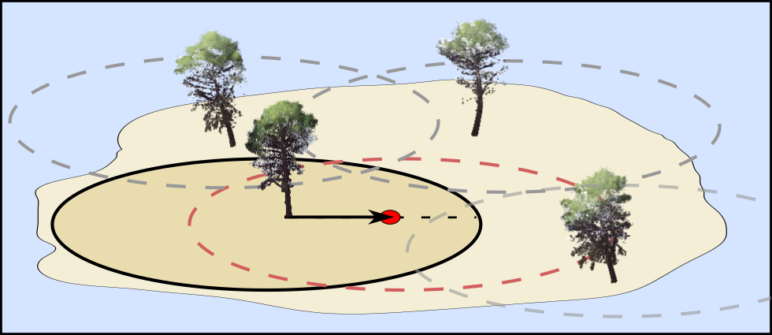
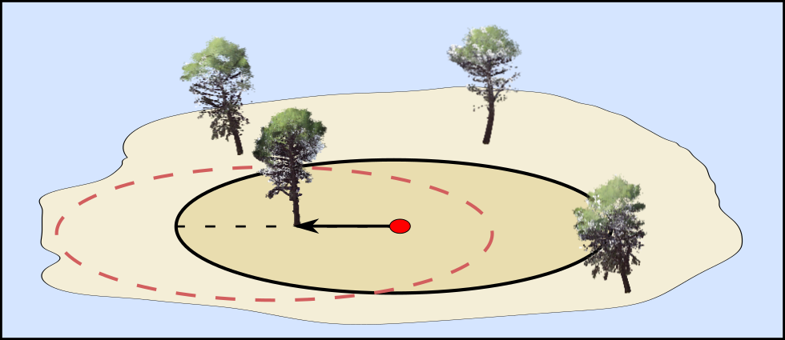

Vamos a considerar el experimento aleatorio de ubicar una parcela uniformemente al azar en la zona a maestrear. A partir de la ubicación de este punto se determinarán los árboles que formarán parte de la muestra. Como la ubicación del punto de muestreo es aleatoria, los árboles que formarán la muestra también lo serán. Podemos analizar el proceso de selección de muestras desde dos puntos de vista complementarios que nos permitirán deducir, de una forma sencilla y visual, probabilidades de inclusión en la muestra ($\pi_i$) y factores de expansión ($w_i$) que nos serán útiles en el proceso de estimación.

Antes de continuar vemos que para un radio determinado, un árbol se mide si está a a una distancia del punto de medición menor de dicho radio. Esto se puede ver de dos formas complementarias

#### Selección basada en áreas de inclusión centradas en los árboles

La primera, forma de ver esto seria haciendo un círculo del radio correspondiente en torno a cada árbol. Si llamamos área de inclusión al área de dicho círculo, podemos decir que mediremos aquellos árboles para los que el punto de medición que hemos aleatorizado cae dentro del área de inclusión del árbol.

#### Selección basada en áreas de inclusión centradas en los árboles

Hay una forma alternativa de ver si debemos muestrear un árbol o no. Dado que da igual que punto escojamos para medir distancias, esta vez, podemos centrarnos en el punto de medición y hacer un circulo (o círculos para parcelas con radio variable). Se medirán los arboles que estén dentro del círculo realizado en torno al punto de medición o centro de parcela.

Mientras que el punto de vista centrado en los árboles es muy gráfico a la hora de determinar probabilidades de incluir un determinado árbol en la muestra. El punto de vista basado en la parcela tiene una interpretación alternativa que es muy útil.

En este ejemplo suponemos que hemos muestreado una zona de una hectárea. En nuestra parcela han entrado cuatro árboles. Si sabemos que nuestra parcela es de $\frac{1}{5}$ hectáreas. En base a nuestras mediciones esperaríamos tener $5x4=20$ árboles en la zona a muestrear. En realidad hay 23 árboles pero el inverso del área podemos ver que el inverso del área de la parcela $\frac{1}{a_{inclusion}}$ nos permite aproximarnos al valor total de árboles por unidad de área. Al inverso del área de la parcela se le llama factor de expansión $w_i=\frac{1}{a_{inclusion}}$ y está directamente relacionado con la probabilidad de inclusión. Mientras que el factor de expansión de un árbol es igual a , $w_i=\frac{1}{a_{inclusion}}$, la probabilidad de inclusión es $\pi_i=\frac{a_{inclusion}}{A}$ por tanto, operando podemos relacionar ambas cantidades de la siguiente manera:

$$
\pi_i=\frac{a_{inclusion}}{A}\rightarrow\pi_i=\frac{1}{Aw_i}
$$

#### Controles de la pestaña

En esta pestaña puedes experimentar con distintos diseños de parcela. En la parte superior tienes el proceso de selección de árboles basado en áreas de inclusión. En la parte inferior tienes el proceso de selección centrado en el punto de medición.

Si activas el control **Todas las áreas de inclusión** podrás ver el área de inclusión de cada árbol para los distintos tipos de parcela. Al pulsar el botón **muestrear**, verás como se destacan los árboles seleccionados (es decir aquellos para los que el punto de parcela ha caído dentro del área de inclusión).

Se consideran los siguientes tipos de parcela:

**Radio fijo**

Para parcelas de radio fijo, la probabilidad de inclusión en la muestra $\pi_i$ para el árbol $i$ es:

$$
\pi_i = \frac{\pi r_p^2}{A}
$$

donde $r_p$ es el radio de la parcela y $A$ el área muestreada en las mismas unidades.

**Radios anidados**

Para parcelas de radio fijo, la probabilidad de inclusión en la muestra $\pi_i$ para el árbol $i$ es:

$$
\pi_i = \begin{cases}
\frac{\pi r_1^2}{A}, & \text{si } dn<15cm\\
\frac{\pi r_2^2}{A}, & \text{si } dn \ge 15cm
\end{cases}
$$

donde $r_1=10$ y $r_2=20$ son los radios asociados a las clases de tamaño 1 (menores de 15 cm de diámetro normal) y 2 (diámetro normal mayor o igual a 15 cm) del ejemplo. $A$ es el área muestreada. **Importante,** hemos considerado los radios de parcela y clases del ejemplo. Si hubiese más de dos clases, el procedimiento seria el mismo, pero tendríamos más casos. Por otro lado, con parcelas de radios anidados y de relascopio, visualmente, puede ser difícil establecer que radio se corresponde con qué árbol.

**Relascopio**

El último tipo de parcela considerado es el de parcelas de relascopio con un BAF de 1. Cuando el BAF es 1, el área de inclusión en metros cuadrados es igual a $\pi_i = \frac{\pi dn_i^2}{4}$ . En base a esto se puede calcular la probabilidad de inclusión del árbol $i$ como:

$$
\pi_i = \frac{\pi dn_i^2}{4A}
$$
